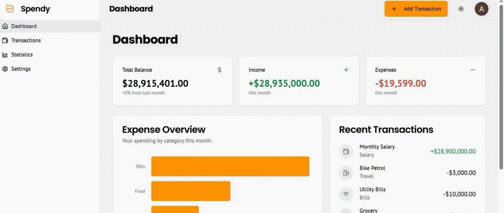

# 💰 Spendy — Your Expenditure Partner

> A modern personal finance tracker built during the **National Agentic AI Hackathon 2025 — Track 2**, focused on simple money management, transaction tracking, financial visualization, and flexible local browser to cloud data synchronization.

**Team:** Team A²  
**Team Leader & Developer:** Ahmad Ali  
**Event:** National Agentic AI Hackathon 2025 — Track 2

[🌐 Live Demo](https://spendy-expense-tracker.netlify.app) •
[📊 Pitch Deck](docs/Spendy_Pitch_Deck_Innovista.pptx) •
[📄 Project Document](docs/Spendy_Your_Expenditure_Partner_Document.pdf)

---

## 🎬 Preview

<p align="center">
  
</p>

> The preview highlights Spendy's primary screens, including the dashboard, transaction management, statistics, and settings experience.

---

## 📌 Overview

**Spendy** is a responsive personal finance tracker designed to help users record income and expenses, categorize transactions, understand spending patterns, and monitor their overall financial activity through a clean and accessible interface.

The project was originally created during the **National Agentic AI Hackathon 2025** and was later refined into a working web application.

Spendy provides two approaches for storing financial information:

- **Browser-Local Mode** 
- **Google Cloud Sync**

The current version is deployed as a **web application**, so an internet connection is required to initially access the hosted website.

Although Browser-Local Mode stores transaction data inside the user's browser using `localStorage`, the current web version should **not be considered a fully offline application**.

---

## 🎯 The Problem

Managing money is a common challenge, particularly for students and young adults.

Many people struggle to consistently answer simple questions such as:

- Where did my money go this month?
- How much did I spend on food, travel, or bills?
- How much income did I receive?
- What is my current balance?
- Which category consumes most of my spending?

As a university student, I observed this problem around me and wanted to create a simple solution that helps users better understand their financial activity without unnecessary complexity.

---

## 💡 Our Approach

Spendy focuses on three main principles:

### 1. Simple Entry

### 2. Useful Financial Visibility

### 3. Optional Cloud Synchronization

This creates a natural progression:

```text
Start Locally
     ↓
Track Transactions
     ↓
Understand Spending
     ↓
Optionally Sign In
     ↓
Synchronize with Firebase
```

## ✨ Key Features

### 💳 Transaction Management

Spendy supports complete transaction management:

- Add income transactions
- Add expense transactions
- Edit existing transactions
- Delete transactions
- Select transaction dates
- Add optional notes
- Categorize transactions
- Filter transactions by type
- Filter transactions by category

## 📊 Financial Dashboard

The dashboard dynamically calculates and displays:

- **Total Balance**
- **Total Income**
- **Total Expenses**
- **Recent Transactions**
- **Expense Overview**

---

## 📈 Statistics & Financial Visualization

Spendy includes interactive financial visualizations such as:

- Income vs. Expense comparison
- Monthly financial trends
- Category spending breakdown
- Expense overview charts
- Donut / pie visualizations

Charts are powered by **Recharts**.

---

## 💱 Multi-Currency Support

Spendy supports **world currencies**.

Examples include:

- **PKR** — Pakistani Rupee
- **USD** — US Dollar
- **EUR** — Euro
- **GBP** — British Pound
- **SAR** — Saudi Riyal
- **AED** — UAE Dirham
- and many more

Users can search for and select a preferred currency from the Settings screen.

---

## 🔁 Data Flow

```
User Opens Spendy
        │
        ├── Browser-Local Mode
        │       │
        │       ├── No account required
        │       │
        │       └── Transactions stored in localStorage
        │
        └── Google Cloud Sync
                │
                ├── Google Authentication
                │
                ├── Existing local transactions checked
                │
                ├── Local records migrated when required
                │
                └── Real-time Firestore synchronization
```

---

## 🏆 Hackathon Context

| Field | Details |
| ---------------- | --------------------------------------------------- |
| **Event**        | National Agentic AI Hackathon 2025                  |
| **Track**        | Track 2                                             |
| **Project**      | Spendy — Your Expenditure Partner                   |
| **Team**         | Team A²                                             |
| **Team Leader**  | Ahmad Ali                                           |
| **Project Type** | Personal Finance / Expense Tracking Web Application |

Spendy began as a hackathon prototype focused on making personal financial tracking simpler and more accessible.

---

## 🚀 What Makes Spendy Different

### Zero-Friction Entry

### Local-to-Cloud Upgrade Path

### Financial Visualization

### Multi-Currency Support

### Clean Responsive Interface

---

## 🛠 Technology Stack

### Frontend & Framework

- **Next.js 15.3.8**
- **React 18.3.1**
- **TypeScript**
- **Next.js App Router**

### Styling & UI

- **Tailwind CSS**
- **shadcn/ui**
- **Radix UI**
- **Lucide React**
- **next-themes**

### Data Visualization

- **Recharts**

### Forms & Validation

- **React Hook Form**
- **Zod**

### Dates & Utilities

- **date-fns**
- **react-day-picker**

### Backend & Cloud

- **Firebase**
- **Firebase Authentication**
- **Google Sign-In**
- **Cloud Firestore**

### Data Persistence

- Browser `localStorage`
- Cloud Firestore
- Real-time Firestore synchronization

### Deployment & Version Control

- **Git**
- **GitHub**
- **Netlify**

---

## 🏗 Project Structure

```
Spendy/
│
├── assets/
│   └── spendy-preview.gif
│
├── docs/
│   ├── Spendy_Pitch_Deck_Innovista.pptx
│   └── Spendy_Your_Expenditure_Partner_Document.pdf
│
├── src/
│   │
│   ├── ai/
│   │   ├── dev.ts
│   │   └── genkit.ts
│   │
│   ├── app/
│   │   │
│   │   ├── (app)/
│   │   │   ├── dashboard/
│   │   │   ├── icon-options/
│   │   │   ├── settings/
│   │   │   ├── statistics/
│   │   │   ├── transactions/
│   │   │   ├── layout.tsx
│   │   │   └── loading.tsx
│   │   │
│   │   ├── globals.css
│   │   ├── layout.tsx
│   │   ├── logo.svg
│   │   └── page.tsx
│   │
│   ├── components/
│   │   ├── dashboard/
│   │   ├── statistics/
│   │   ├── transactions/
│   │   └── ui/
│   │
│   ├── context/
│   │   ├── data-sync.ts
│   │   ├── settings-context.tsx
│   │   └── transaction-context.tsx
│   │
│   ├── firebase/
│   │   ├── firestore/
│   │   ├── auth.ts
│   │   ├── config.ts
│   │   ├── index.ts
│   │   ├── provider.tsx
│   │   └── user-service.ts
│   │
│   ├── hooks/
│   │
│   └── lib/
│       ├── currencies.ts
│       ├── data.ts
│       ├── types.ts
│       └── utils.ts
│
├── .gitignore
├── components.json
├── next.config.ts
├── package.json
├── package-lock.json
├── postcss.config.mjs
├── tailwind.config.ts
└── tsconfig.json
```

---

## 🚀 Getting Started

### Prerequisites

Make sure you have installed:

- Node.js 20.x or newer
- npm
- Git

---

### 1. Clone the Repository

```
git clone https://github.com/Ahmadali-dev375/Spendy-Expense-Tracker-Hackathon.git
```

---

### 2. Enter the Project Directory

```
cd Spendy-Expense-Tracker-Hackathon
```

---

### 3. Install Dependencies

```
npm install
```

---

### 4. Start the Development Server

```
npm run dev
```

Then open the local development URL displayed in your terminal.

---

## 📚 Hackathon Materials

The original project material is included directly inside this repository.

### 📊 Spendy Pitch Deck

[**Open / Download Spendy Pitch Deck**](docs/Spendy_Pitch_Deck_Innovista.pptx)

### 📄 Spendy Project Document

[**Open Spendy — Your Expenditure Partner Project Document**](docs/Spendy_Your_Expenditure_Partner_Document.pdf)

---

## ⚠️ Limitations

Spendy remains a hackathon-originated project and has several areas that can be expanded.

### Fixed Category Set

The current implementation contains six predefined categories:

```
Food
Travel
Bills
Shopping
Salary
Other
```

### Single-Wallet Model

Spendy currently treats financial activity as one combined financial balance.

Future versions could support multiple wallets such as:

- Bank accounts
- Credit cards
- Other wallets

---

## 🌐 Deployment

Spendy is deployed publicly using **Netlify**.

### Live Application

👉 [**Open Spendy Live**](https://spendy-expense-tracker.netlify.app)

---

## 🔐 Security & Privacy

Spendy supports two storage approaches.

### Browser-Local Mode

Financial records remain inside the user's browser storage unless the user explicitly chooses cloud synchronization.

### Firebase Cloud Mode

Authenticated cloud records are stored under user-specific Firestore paths.

---

## 👨‍💻 Author & Credits

### Ahmad Ali

**Team Leader — Team A²**

---

## 📄 License

This project currently has **no explicit open-source license**.

All rights are reserved by the project authors unless a license is added in a future release.
